# 로블록스 스튜디오 설치하기
- 작성자 : 최지원
  

## 목표
- 로블록스 스튜디오 설치하기
  

## 로블록스 로그인

우선, [Google](https://www.google.com/) 검색창에 `Roblox`를 검색합니다.  
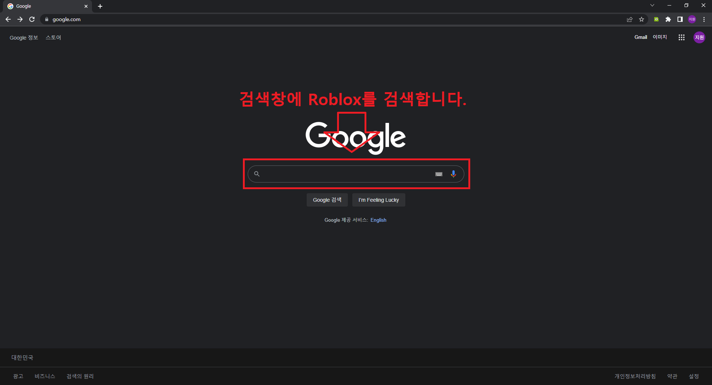  

`Roblox` 를 검색했으면, 아래의 Roblox 링크를 클릭하여 Roblox 사이트에 접속합니다.  
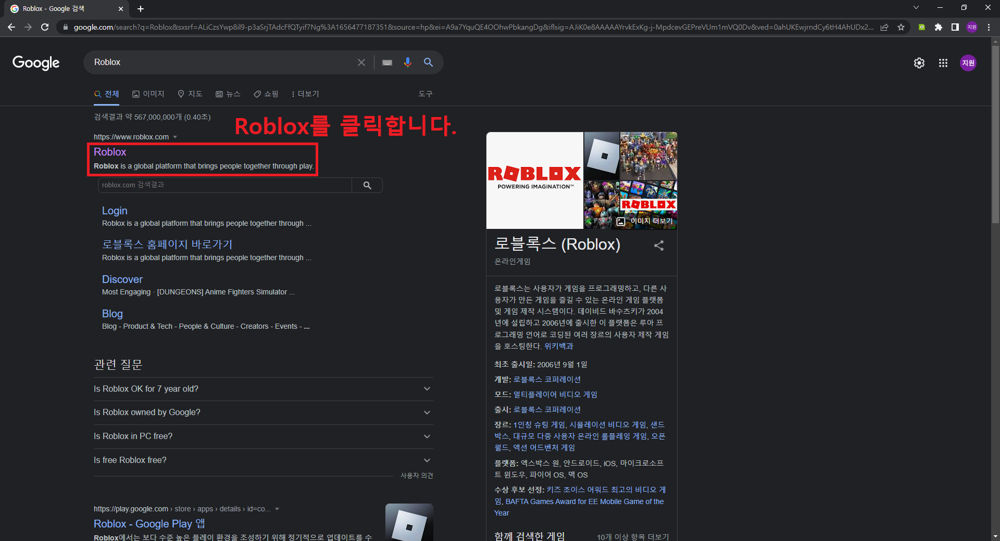  

Roblox 사이트에 접속했으면, 오른쪽 상단의 로그인 버튼을 클릭합니다.  
만약, 계정이 없다면 가운데의 가입칸을 이용해서 로블록스 계정을 생성한 후 로그인 버튼을 클릭합니다.  
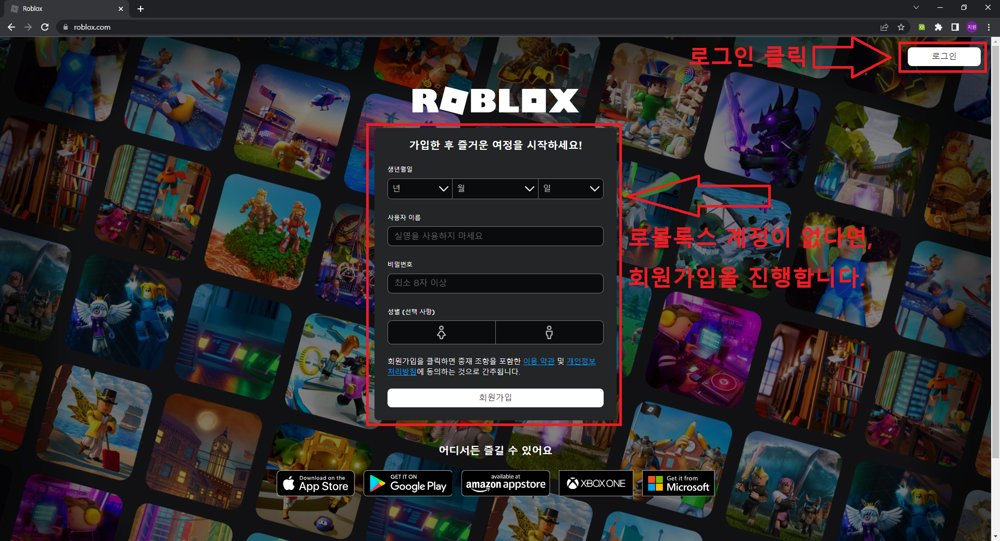  

로그인 버튼을 클릭했으면, 아이디와 비밀번호를 입력하여 로그인합니다.  
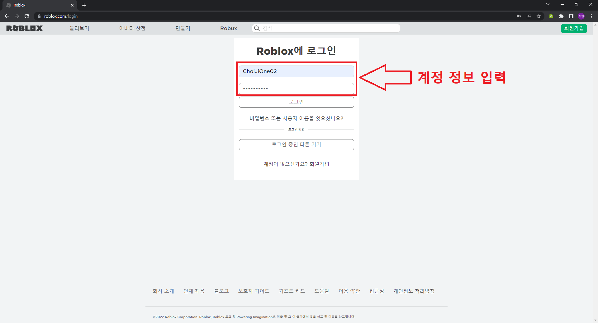  

로그인을 완료했다면, 다음 아래의 이미지와 같은 화면을 볼 수 있습니다.  
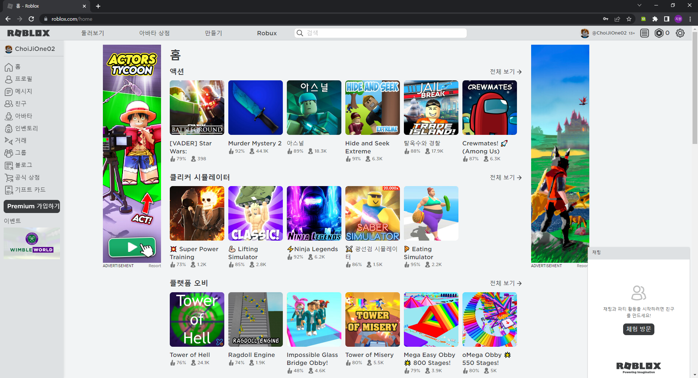  

  

## 로블록스 스튜디오 설치하기

로블록스 사이트에 로그인을 완료했다면, 상단의 만들기 버튼을 클릭합니다.  
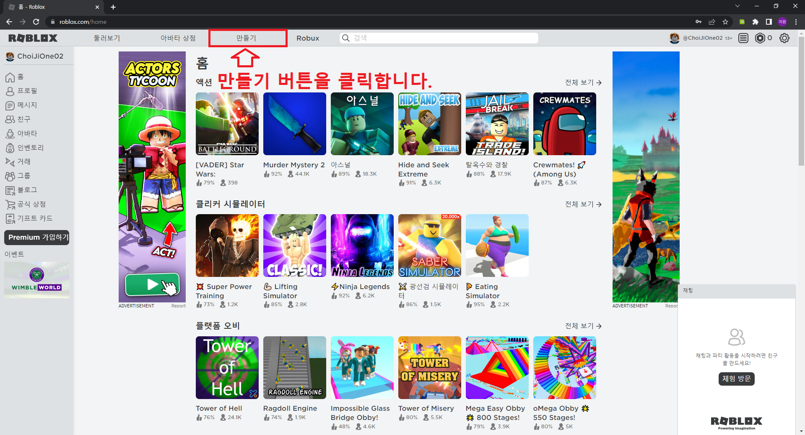  

다음으로, 가운데의 만들기 시작 버튼을 클릭합니다.  
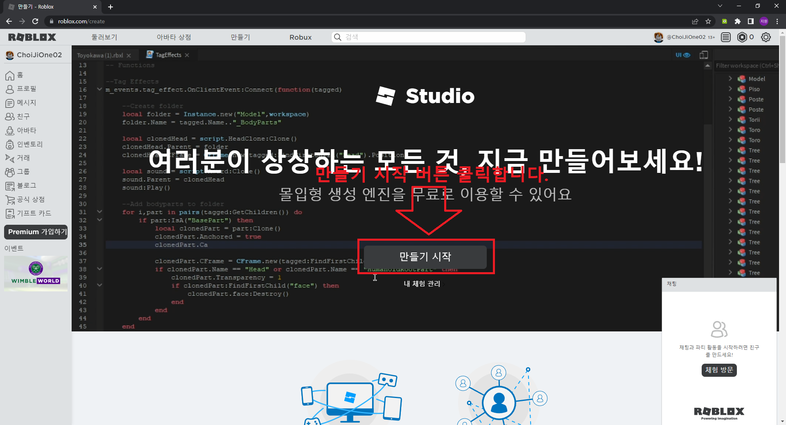  

만들기 시작 버튼을 클릭하면 Studio 다운로드 버튼이 보입니다.  
Studio 다운로드 버튼을 클릭하여 로블록스 스튜디오 설치 파일 다운로드를 진행합니다.  
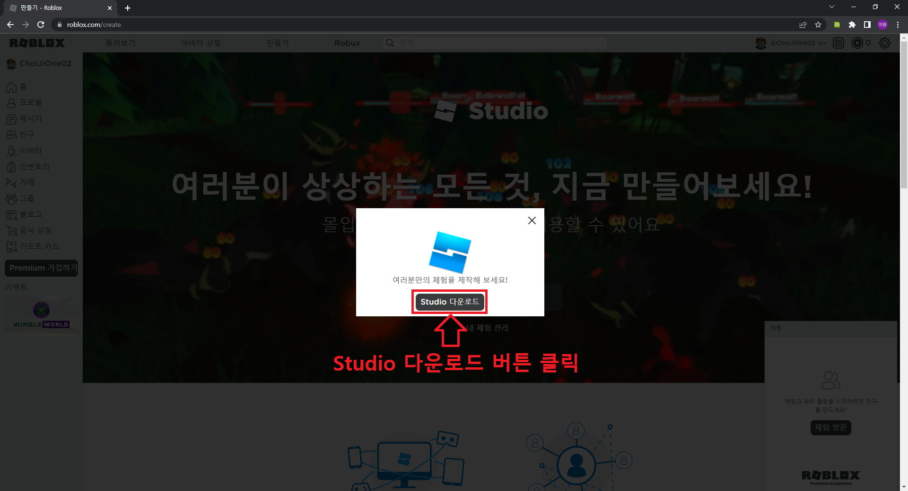  

다운로드가 완료되었다면, 아래의 로블록스 스튜디오 설치 파일을 클릭하여 실행합니다.  
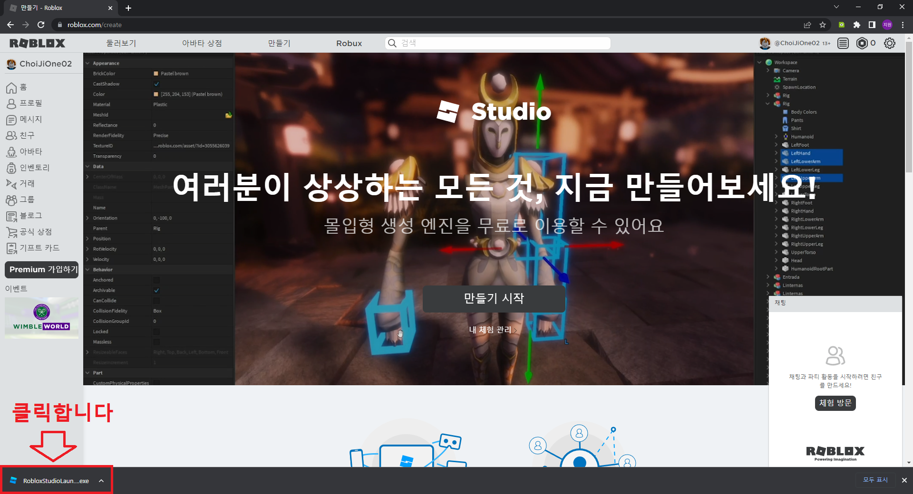  

클릭하면, 다음과 같이 설치가 진행되는 것을 볼 수 있습니다.  
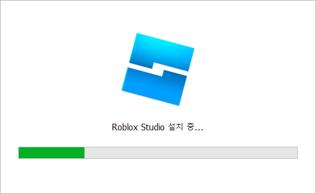  

설치가 완료되면 아래의 이미지와 같은 화면을 볼 수 있습니다.  
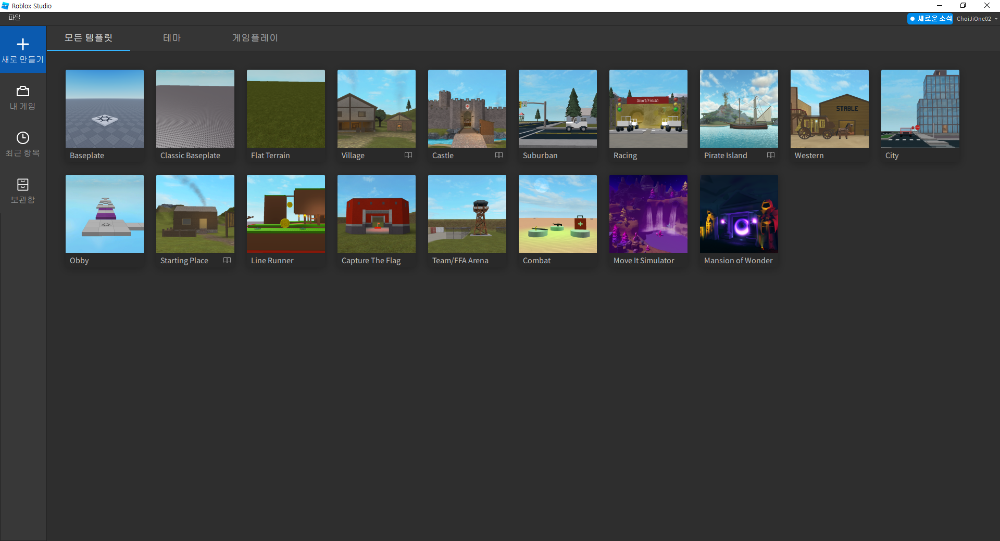  

여기까지 무사히 오셨다면, 로블록스 설치를 완료한 것입니다.  