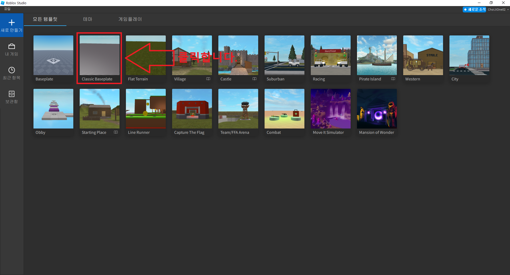
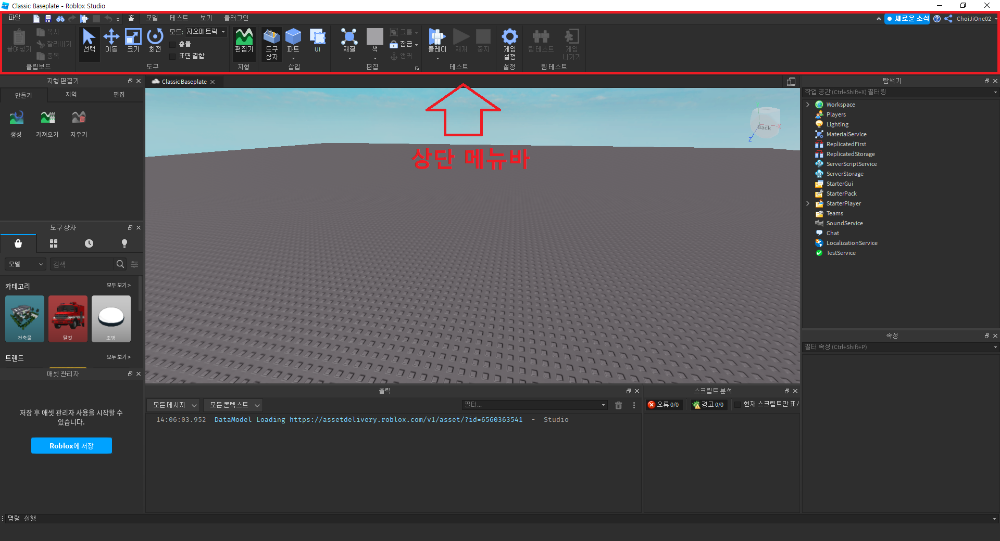
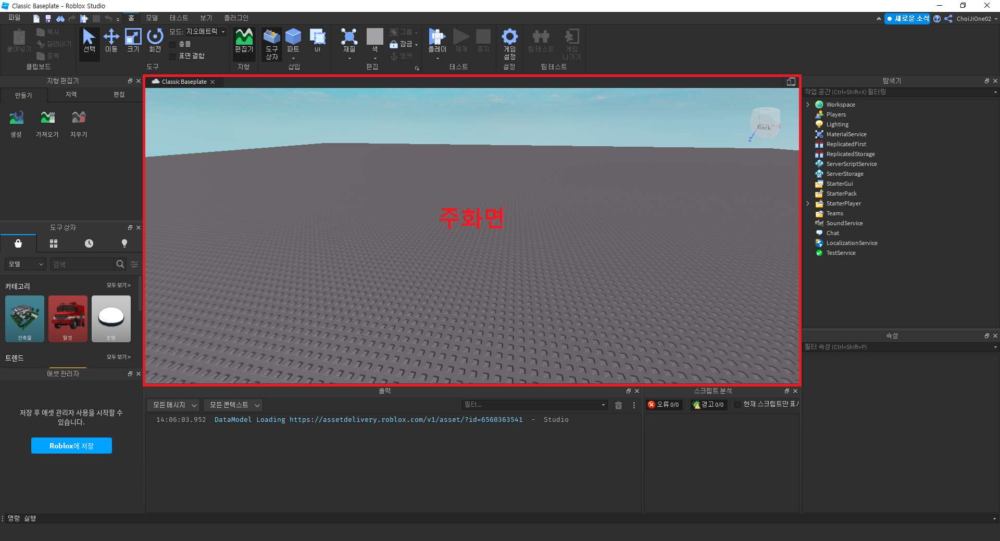
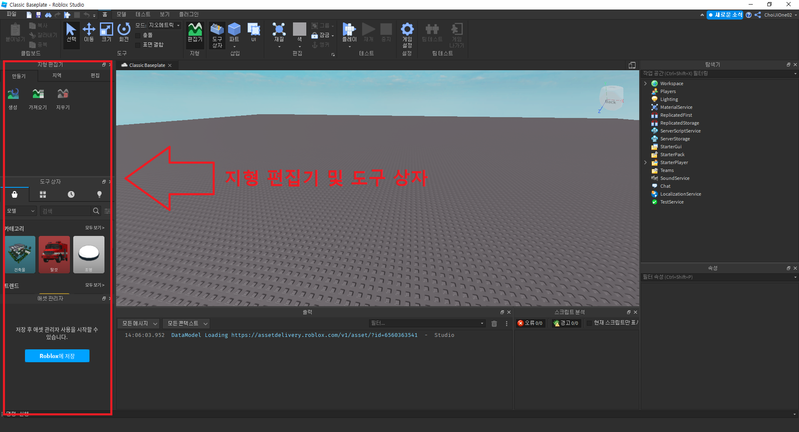
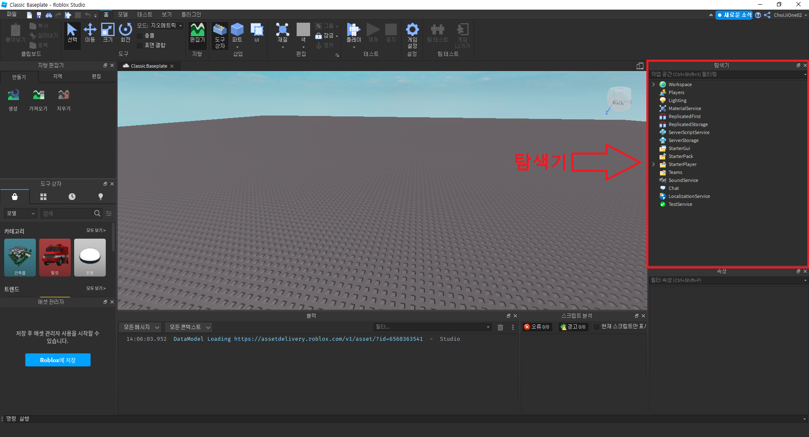
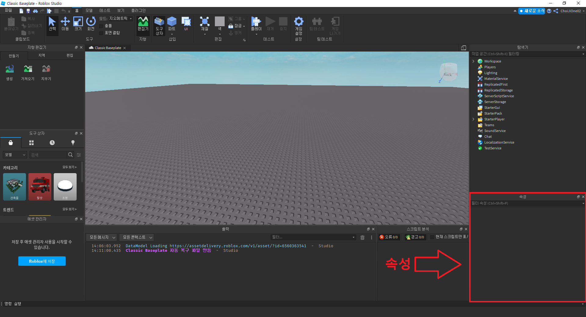
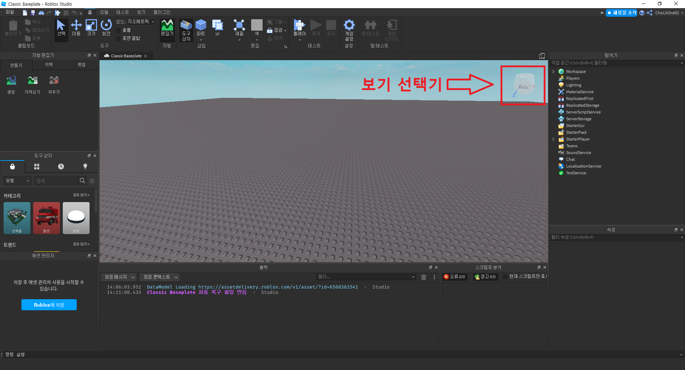

# 로블록스 스튜디오 둘러보기
- 작성자 : 최지원
  

## 목표
- 로블록스 스튜디오의 구성 요소 둘러보기  
  

## 로블록스 스튜디오를 둘러보기 위한 사전 준비

우선, 로블록스 스튜디오를 둘러보기 위해서 아래의 `Classic Basetemplate`을 클릭합니다.  
  

클릭을 하면 아래의 이미지와 같은 화면을 볼 수 있습니다.  
  

  

## 로블록스 스튜디오 둘러보기

### 상단 메뉴바

상단 메뉴바는 게임 제작에 사용되는 명령 아이콘과 각종 메뉴 목록이 있는 메뉴바입니다.  
  

### 주화면

주화면은 게임 환경을 볼 수 있는 화면입니다.  
지형을 만들거나 주인공이 생성되는 위치, 적 및 아이템을 배치할 수 있습니다.  
  

### 지형 편집기 및 도구 상자

지형 편집기 및 도구 상자는 지형을 편집하거나 도구를 사용할 수 있습니다.  
만드는 게임에 적합한 지형을 만들거나 마켓플레이스에서 리소스를 가져옵니다.  
 

### 탐색기

탐색기는 게임에 사용되는 각종 재료들이 전부 표시됩니다.  
조명, 괴물, 아이템, 루아 스크립트, 소리 파일 등 게임에 사용되는 모든 재료들을 볼 수 있습니다.  
  

### 속성

속성은 게임 제작에 사용되는 재료들의 특성을 확인하고 수정할 수 있습니다.  
색상을 바꾸거나 크기를 크게하고 위치도 바꿀 수 있습니다.  
  

### 보기 선택기

보기 선택기는 원하는 방향의 면을 클릭하면 3D 가상 공간에 해당하는 방향의 공간을 바라보도록 할 수 있습니다.   
  