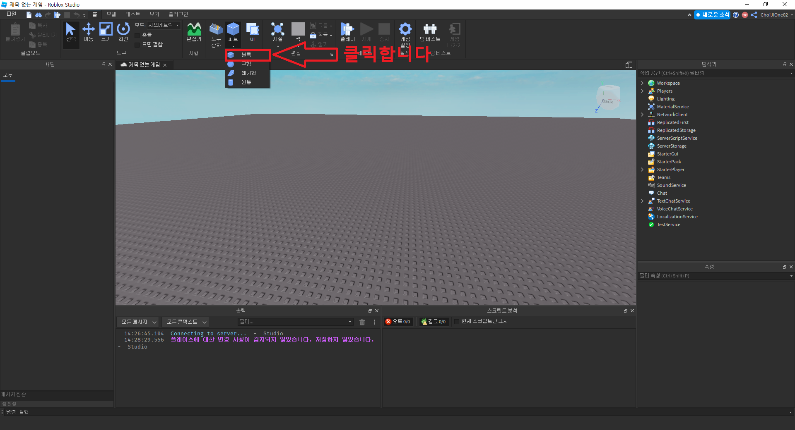
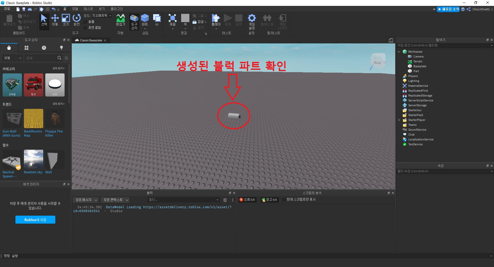
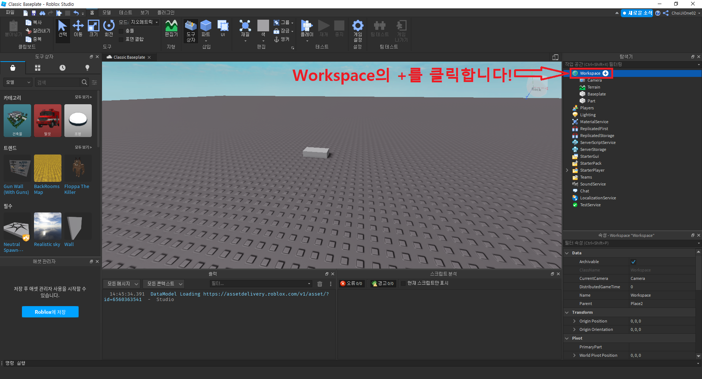
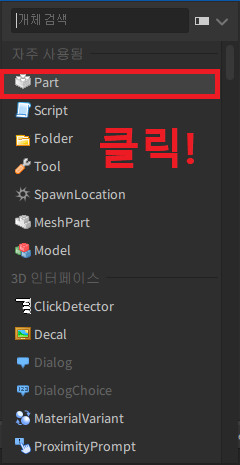
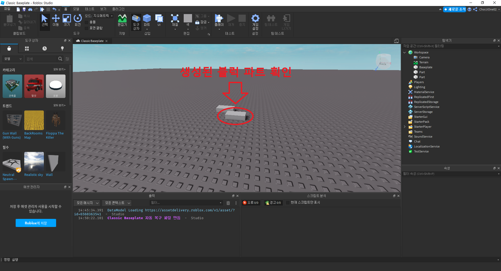
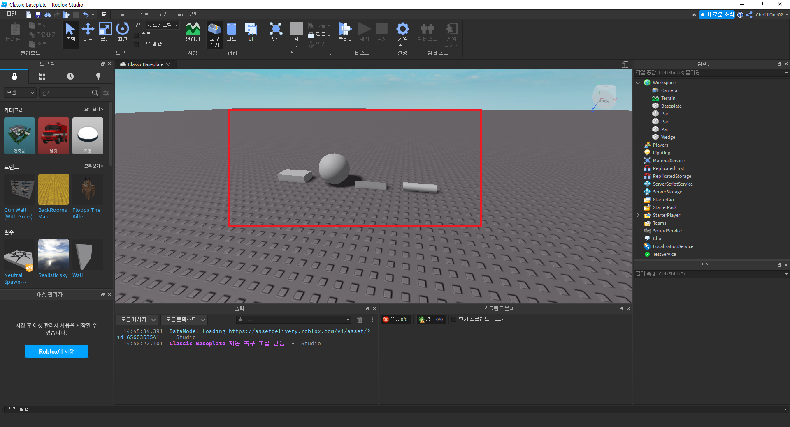

# 파트 생성해보기
- 작성자 : 최지원
  

## 목표
- 파트(Part) 생성하기
  

## 파트(Part)란?

파트란, 게임 내의 물리 객체를 의미합니다.  
쉽게 생각해보면, 게임 내에 있는 물체라고 생각하면 될거 같네요.  
로블록스 문서에는 다음과 같이 설명합니다.  

> The Part object is a physical object

  

## 블럭 파트 생성해보기

로블록스의 기본 파트는 *블록*, *구형*, *쐐기형*, *원통* 이 있습니다.  
그럼, 블록 파트를 생성해보도록 하겠습니다.  
상단 메뉴바의 파트에서 블럭을 클릭합니다.  
  

클릭을 하게 되면 아래와 같이 생성된 블럭 파트를 확인할 수 있습니다.  
  

다른 방법으로 생성할 수도 있습니다.  
탐색기에서 Workspace의 +키를 클릭합니다.  
  

+키를 클릭하면, 아래의 이미지와 같은 화면을 볼 수 있습니다.  
Part를 클릭합니다.  
  

클릭을 하게 되면 아래와 같이 생성된 블럭 파트를 확인할 수 있습니다.  
  

다른 파트도 같은 방식으로 생성할 수 있습니다.  
  

  

## Reference
- [Roblox Developer : Part](https://developer.roblox.com/en-us/api-reference/class/Part)