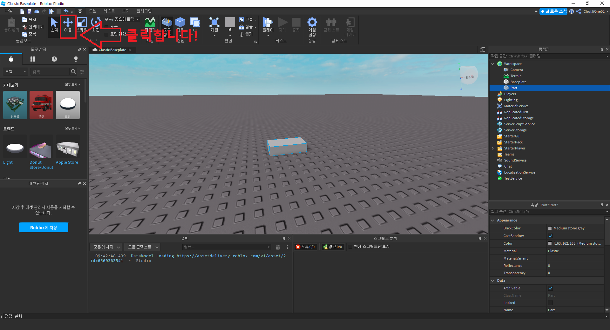
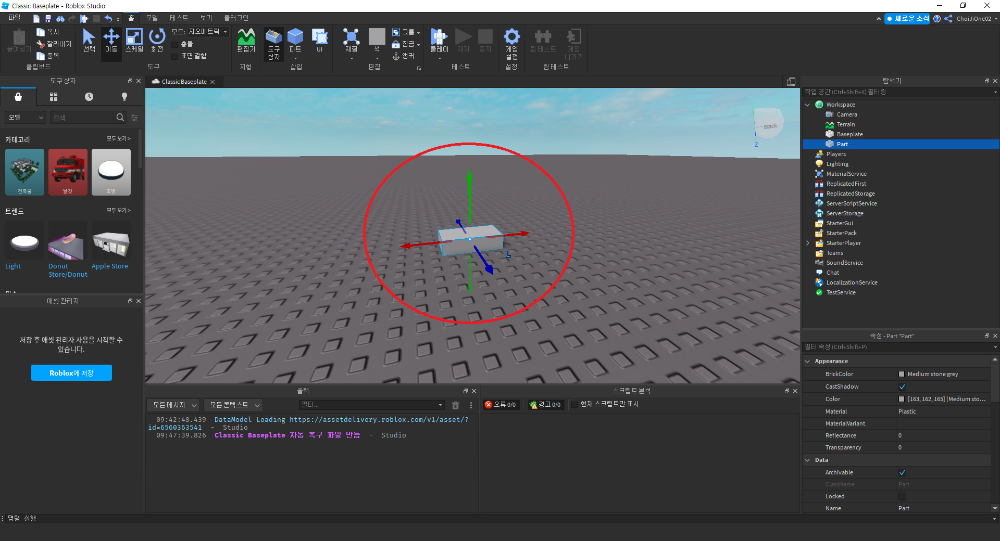
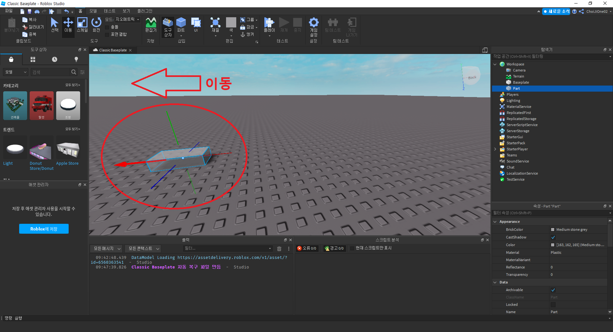
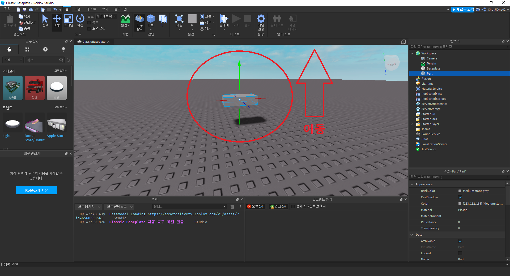
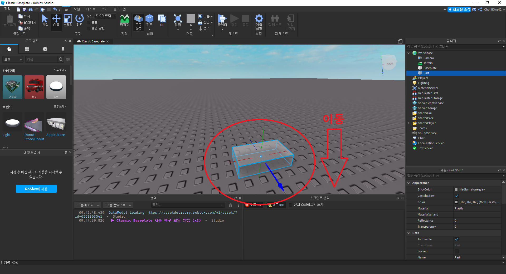
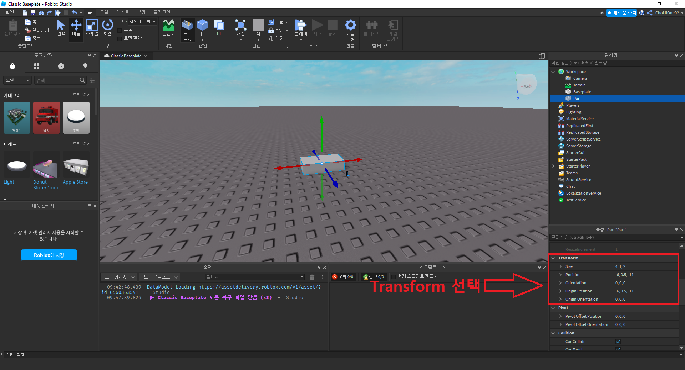
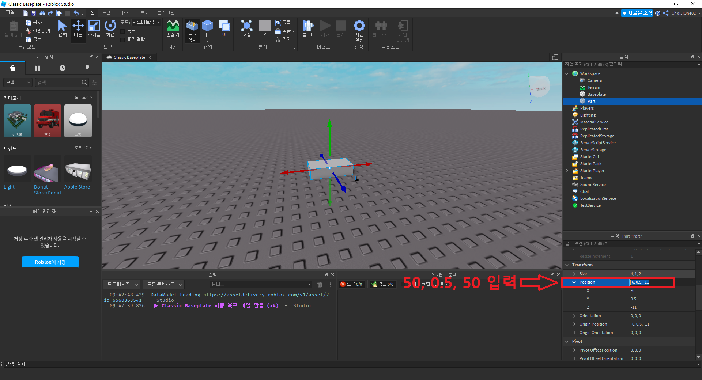
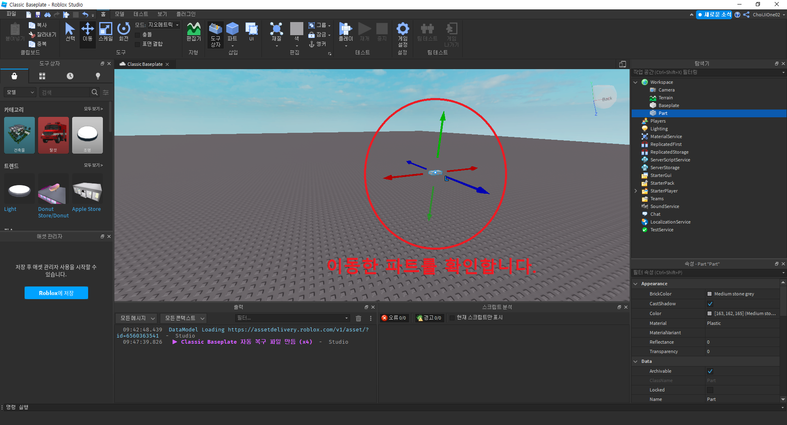

# 파트 이동시켜보기
- 작성자 : 최지원
  

## 목표
- 파트 이동시키기
  

## 파트 이동시켜보기

파트를 이동시켜보도록 하겠습니다.  
이동시킬 파트를 선택 후 상단 메뉴바의 이동 버튼을 클릭합니다.  
  

이동 버튼을 클릭하면, 아래 이미지와 같이 빨간색, 초록색, 파란색 축을 볼 수 있습니다.  
  

x축 방향으로 이동하고 싶으면, 빨간색 축을 마우스로 클릭한 후 이동시키면 파트를 x축 방향으로 이동시킬 수 있습니다.  
  

y축 방향으로 이동하고 싶으면, 초록색 축을 마우스로 클릭한 후 이동시키면 파트를 y축 방향으로 이동시킬 수 있습니다.  
  

z축 방향으로 이동하고 싶으면, 파란색 축을 마우스로 클릭한 후 이동시키면 파트를 z축 방향으로 이동시킬 수 있습니다.  
  

다른 방법으로 이동시킬 수도 있습니다.  
이동시킬 파트를 선택 후 속성의 Transform을 선택합니다.  
  

다음으로 `Position`을 클릭하여 `50, 0.5, 50` 를 입력합니다. 
  

`50, 0.5, 50` 으로 이동한 파트를 확인합니다.  
  

  