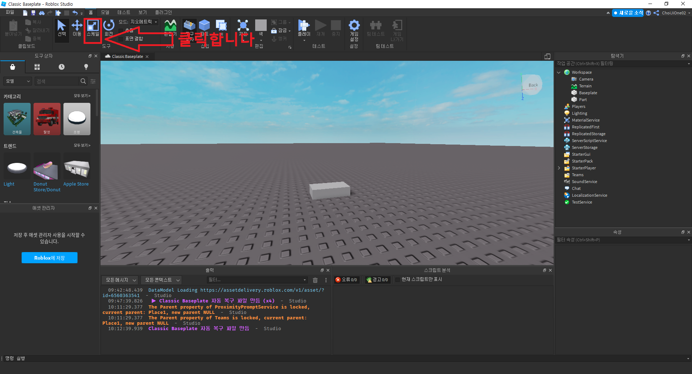
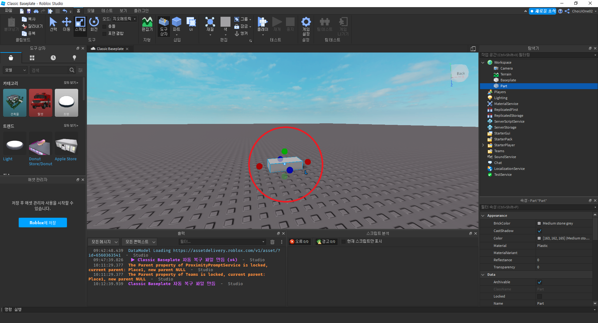
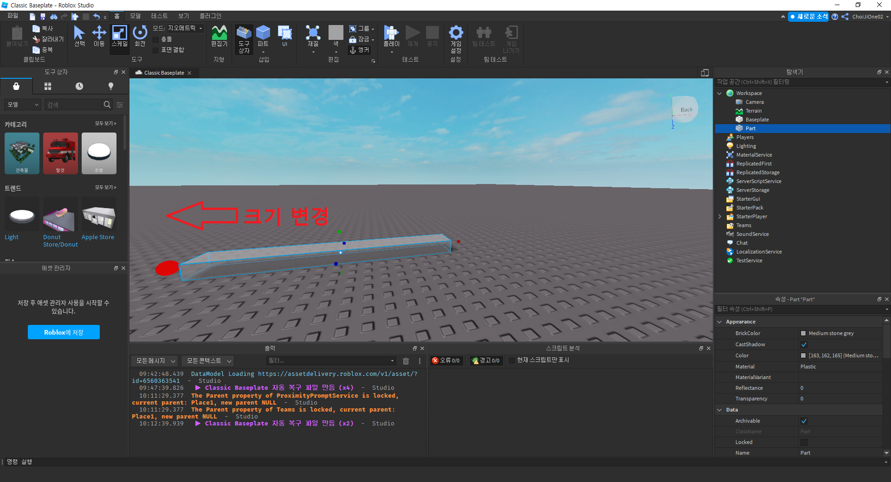
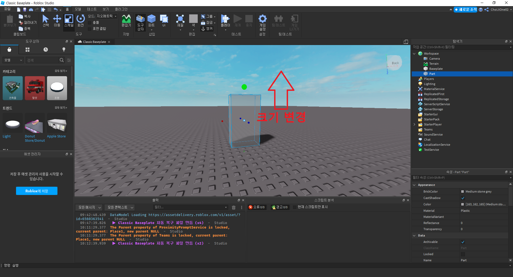
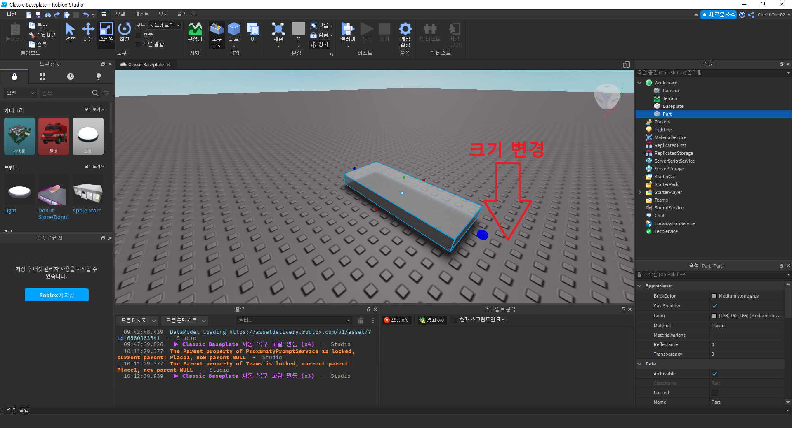
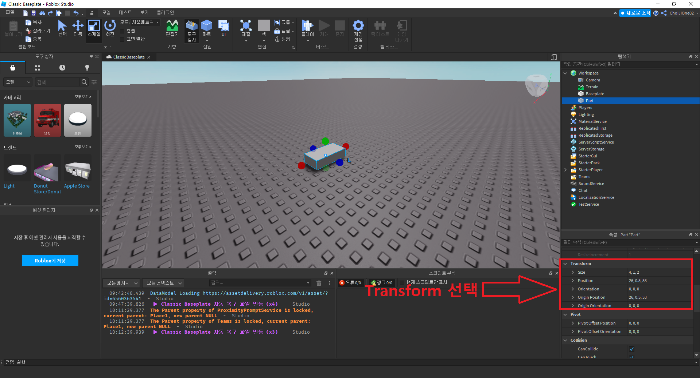
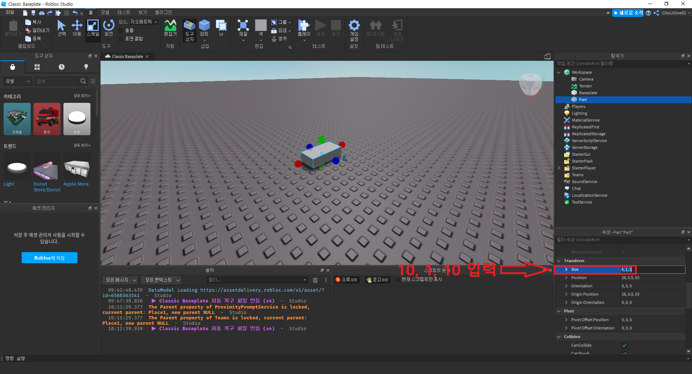
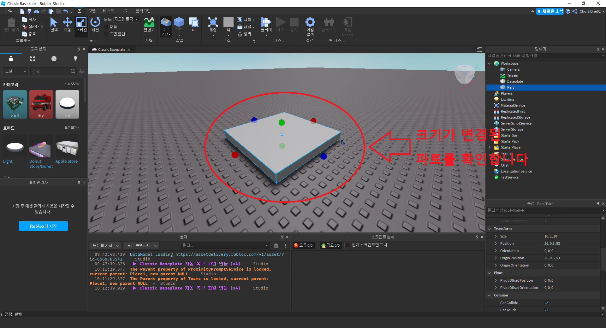

# 파트 크기 바꿔보기
- 작성자 : 최지원
  

## 목표
- 파트 크기 바꾸기
  

## 파트 크기 바꿔보기

파트의 크기를 바꿔보도록 하겠습니다.  
크기를 바꿀 파트를 선택 후 상단 메뉴바의 스케일 버튼을 클릭합니다.  
  

스케일 버튼을 클릭하면, 아래 이미지와 같이 빨간색, 초록색, 파란색 원을 볼 수 있습니다.  
  

x축 방향으로 크기를 바꾸고 싶으면, 빨간색 원을 마우스로 클릭한 후 이동시키면 x축 방향으로 파트의 크기를 바꿀 수 있습니다.  
  

y축 방향으로 크기를 바꾸고 싶으면, 초록색 원을 마우스로 클릭한 후 이동시키면 y축 방향으로 파트의 크기를 바꿀 수 있습니다.  
  

z축 방향으로 크기를 바꾸고 싶으면, 파란색 원을 마우스로 클릭한 후 이동시키면 z축 방향으로 파트의 크기를 바꿀 수 있습니다.  
  

다른 방법으로 이동시킬 수도 있습니다.  
크기를 바꿀 파트를 선택 후 속성의 Transform을 선택합니다.  
  

다음으로 `Size`를 클릭하여 `10, 1, 10` 를 입력합니다.  
  

`10, 1, 10` 으로 크기가 변경된 파트를 확인합니다.  
  