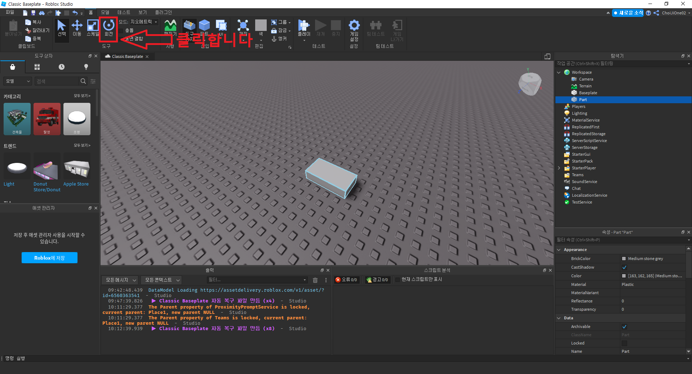
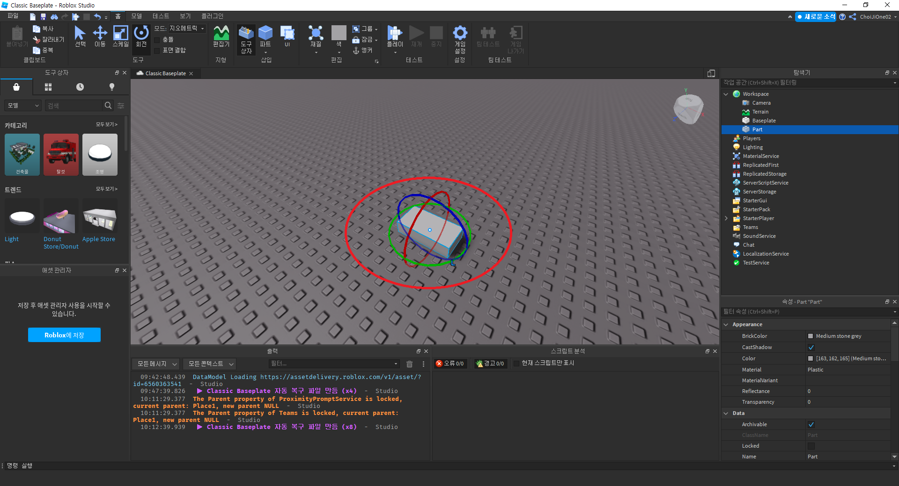
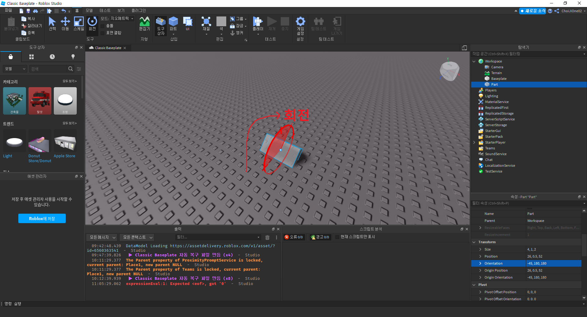
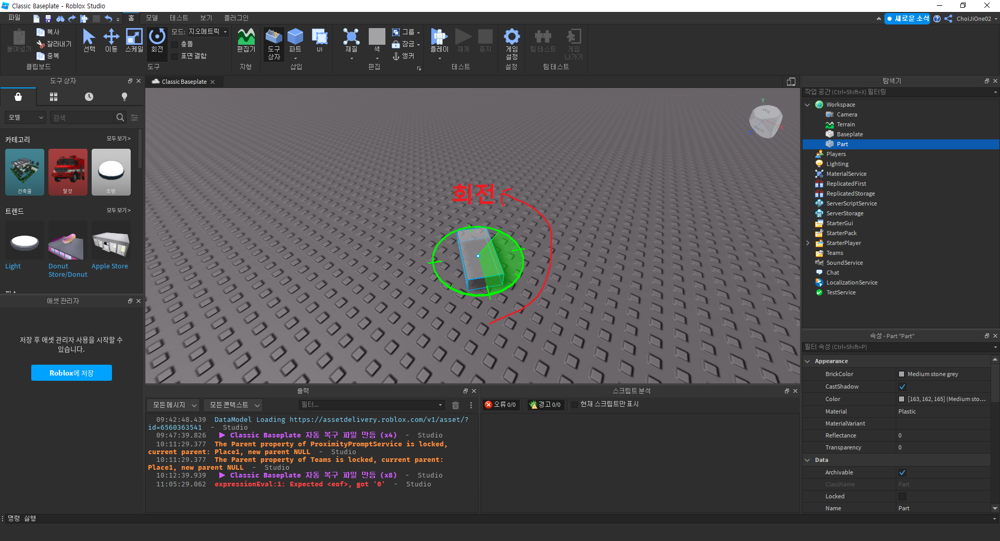
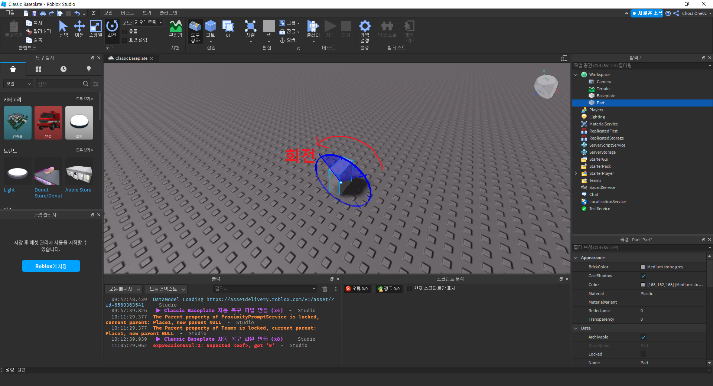
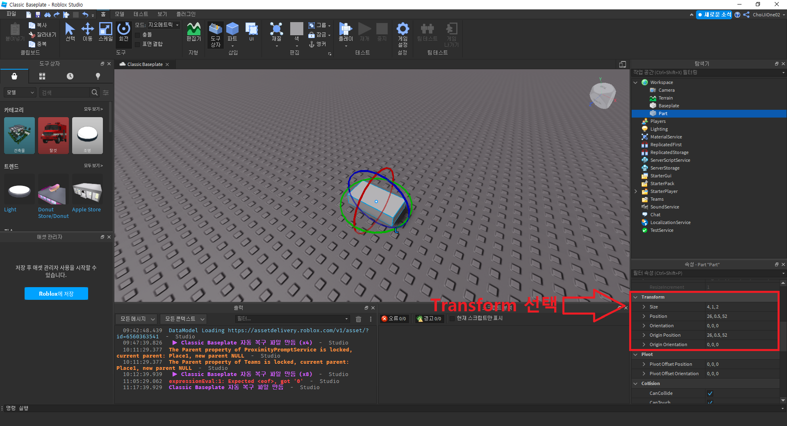
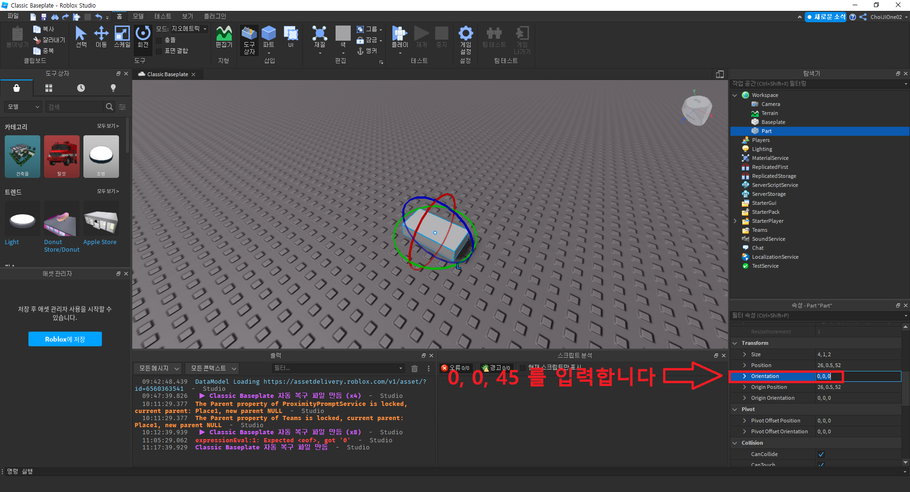
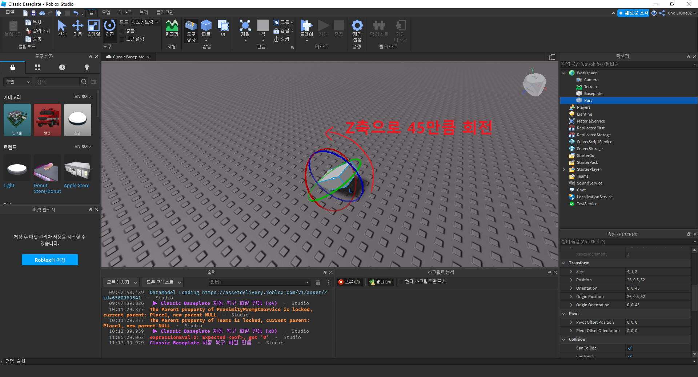

# 파트 회전시키기
- 작성자 : 최지원
  

## 목표
- 파트 회전시키기
  

## 파트 회전시키기

파트를 회전시켜보도록 하겠습니다.  
회전시킬 파트를 선택 후 상단 메뉴바의 회전 버튼을 클릭합니다.  
  

회전 버튼을 클릭하면, 아래 이미지와 같은 빨간색, 초록색, 파란색 원을 볼 수 있습니다.  
  

x축을 기준으로 회전시키고 싶다면, 빨간색 원을 마우스로 클릭한 후 이동시키면 x축을 기준으로 파트를 회전시킬 수 있습니다.  
  

y축을 기준으로 회전시키고 싶다면, 초록색 원을 마우스로 클릭한 후 이동시키면 y축을 기준으로 파트를 회전시킬 수 있습니다.  
  

z축을 기준으로 회전시키고 싶다면, 파란색 원을 마우스로 클릭한 후 이동시키면 z축을 기준으로 파트를 회전시킬 수 있습니다.  
  

다른 방법으로 회전시킬 수도 있습니다.  
회전할 파트를 선택 후 속성의 Transform을 선택합니다.  
  

다음으로 `Orientation`을 클릭하여 `0, 0, 45` 를 입력합니다.  
  

`0, 0, 45` 으로 회전된 파트를 확인합니다.  
  