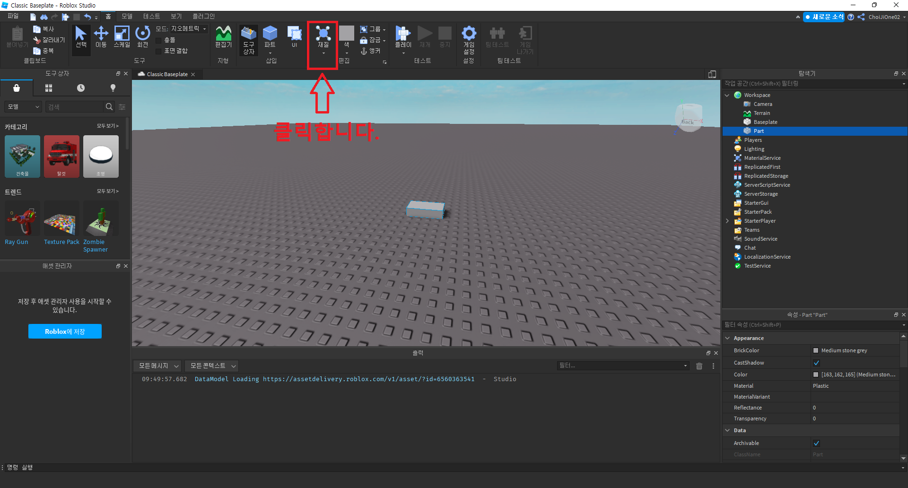
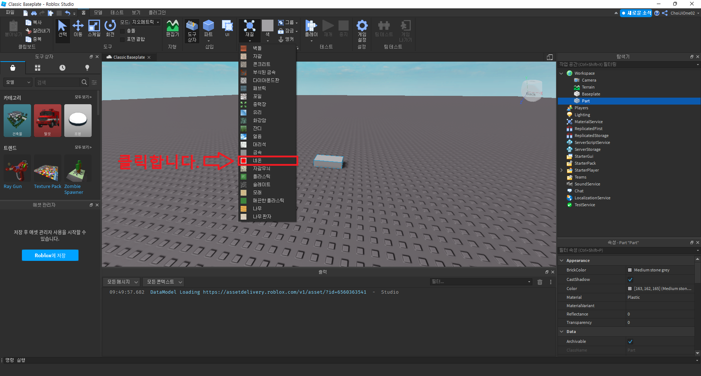
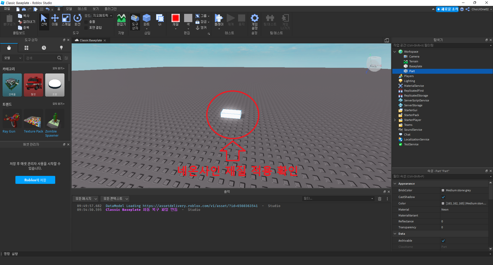

# 파트에 재질(Material) 적용시키기
- 작성자 : 최지원
  

## 목표
- 파트에 재질(Material) 적용시키기
  

## 파트에 재질(Material) 적용시키기

파트에 재질(Material)을 적용시켜보겠습니다.  
재질을 적용할 파트를 선택 후 상단 메뉴바의 재질을 클릭합니다.  
  

클릭하게 되면 아래의 이미지와 같이 여러 개의 재질을 확인할 수 있습니다. 재질 적용을 위해 네온을 클릭합니다.  
  

클릭을 하게 되면 아래의 이미지와 같이 파트에 네온 재질(Material)이 적용된 것을 확인할 수 있습니다.  
  
  