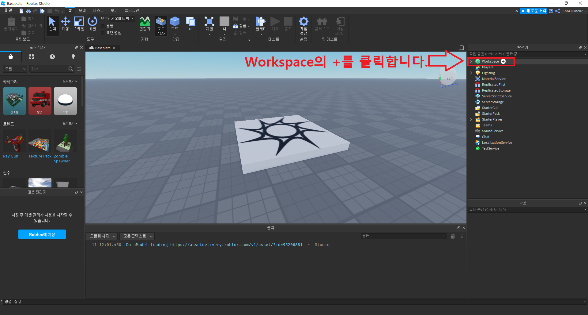
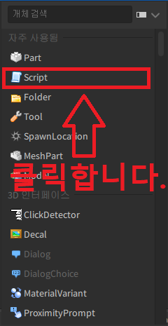
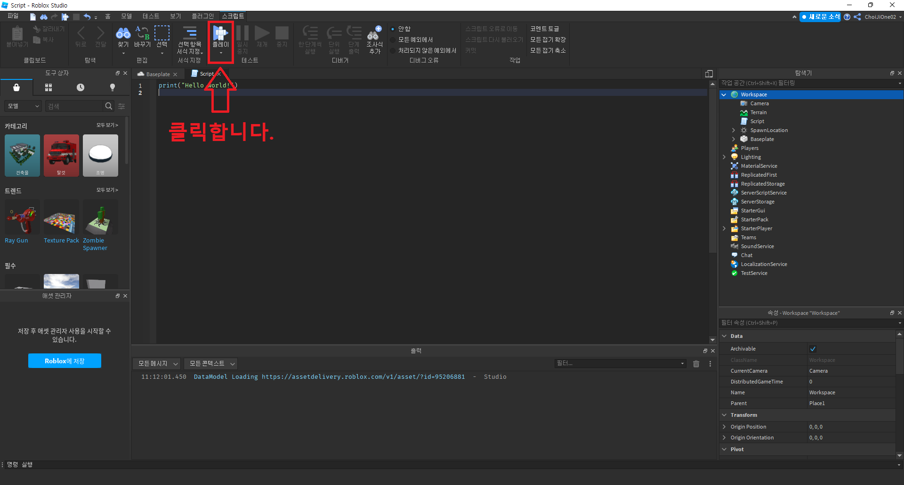
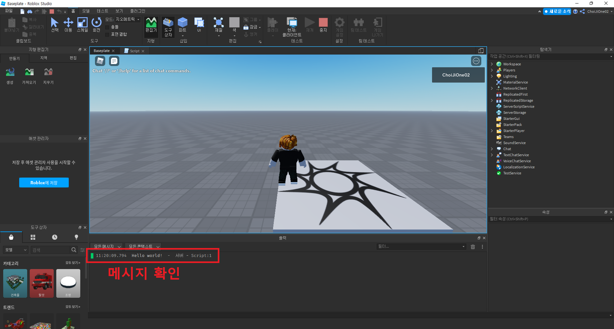

# 스크립트 생성하기
- 작성자 : 최지원
  

## 목표
- 로블록스 스튜디오에서 루아(lua) 스크립트 생성하기
  

## 루아 스크립트 생성하기

탐색기에서 Workspace의 +키를 클릭합니다.  
  

클릭하면, 아래와 같은 이미지의 화면을 볼 수 있는데 Script를 클릭합니다.  
  

Script를 클릭하면 창이 변하면서 `print("Hello World!")` 가 작성되있는 Script를 볼 수 있습니다. 확인했으면 상단 메뉴바의 플레이 버튼을 클릭합니다.  
  

플레이 버튼을 클릭하면 아래와 같은 이미지의 화면처럼 `Hello World!`를 볼 수 있습니다.  
  