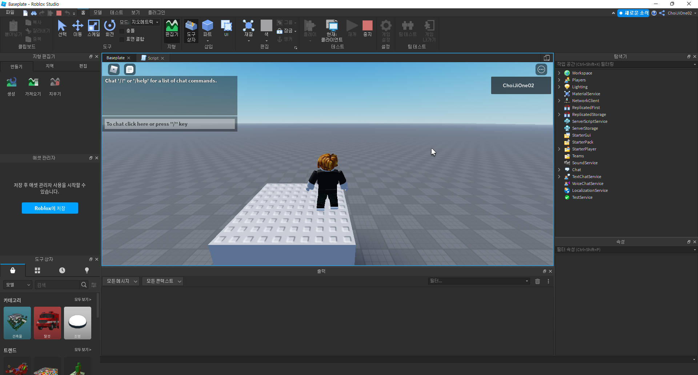
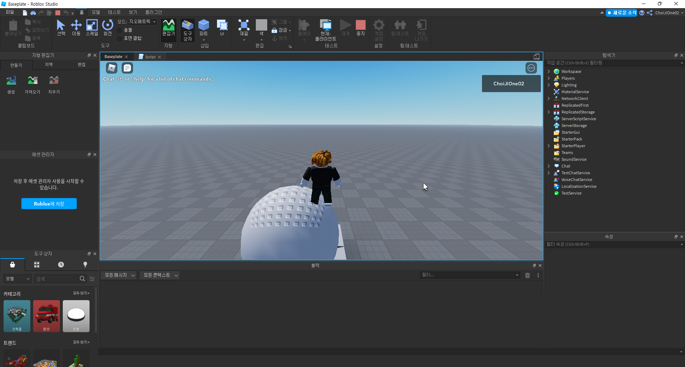

# 스크립트 내에서 파트 생성하기
- 작성자 : 최지원
<br><br>


## 목표
- 스크립트 내에서 파트 생성하기
<br><br>


## 스크립트 내에서 파트 생성하기

스크립트 내에서 파트를 생성하는 코드와 결과는 다음과 같습니다.  
```
local newPart = Instance.new("Part", game.Workspace)

newPart.Position = Vector3.new(0, 5, 0)
newPart.Size = Vector3.new(10, 10, 10)
newPart.Anchored = true
```
  
<br><br>


## 스크립트 내에서 특정 파트 생성하기

스크립트 내에서 특정 타입의 파트를 생성하는 코드는 다음과 같습니다.  
```
local newPart = Instance.new("Part", game.Workspace)

newPart.Shape = Enum.PartType.Ball
newPart.Position = Vector3.new(0, 5, 0)
newPart.Size = Vector3.new(10, 10, 10)
newPart.Anchored = true
```
  
<br><br>


## Reference
- https://scriptinghelpers.org/questions/61458/how-could-i-add-fire-to-this-fireball-script-i-made