# Obby
- 작성자 : 최지원
<br><br>


## 목표
- 아래와 같은 게임을 제작합니다.
<br><br>


## 1단계. 프로젝트 생성 및 준비

`Roblox Studio`를 실행한 후 새로 만들기에서 `Baseplate`를 클릭합니다.  
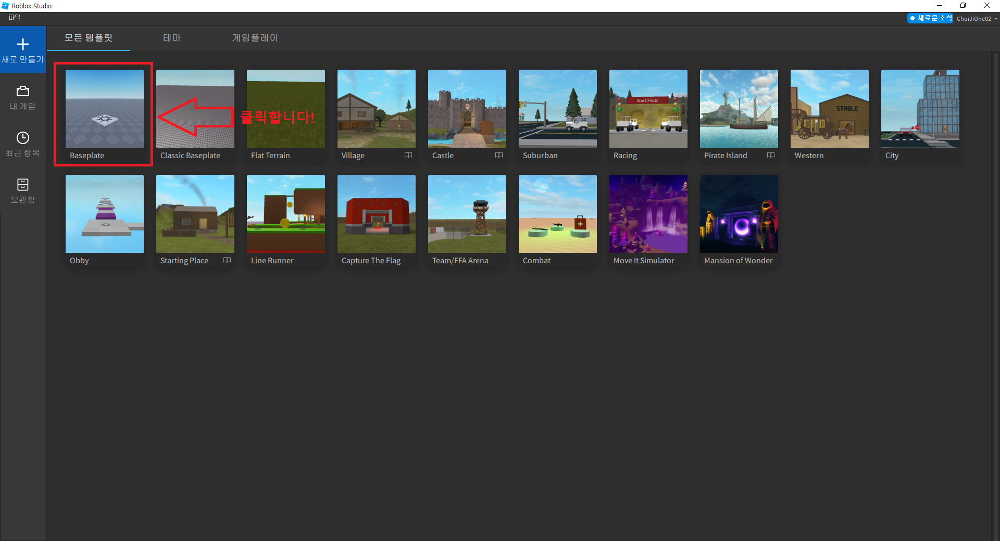  

우선, 게임 제작을 하기 전에 상단의 파일을 클릭 후 다른 이름으로 저장 버튼을 클릭합니다.  
혹은 `Ctrl + Shift + S`를 클릭합니다.  
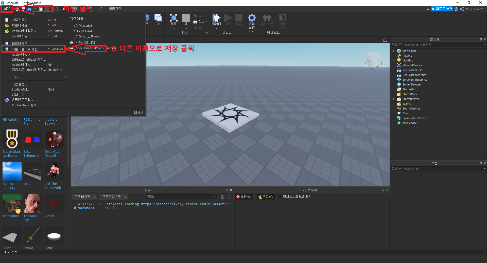  

파일 이름을 `MiniGame-Obby.rbxl` 로 설정한 뒤에 원하는 위치에 저장합니다.
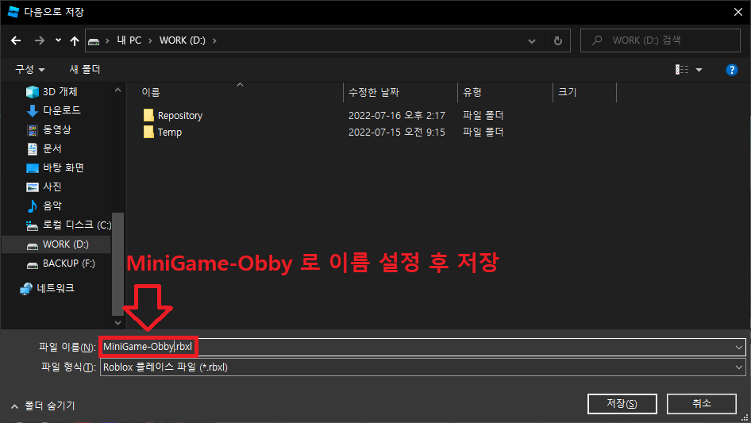  

다음으로, 우리가 사용하지 않을 `Baseplate`를 삭제하도록 하기 위해서 탐색기의 Baseplate를 삭제합니다.
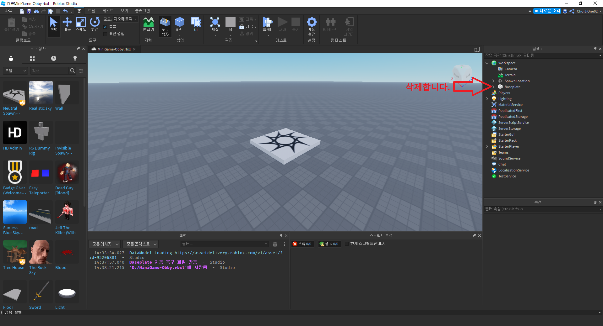  

삭제된 Baseplate를 확인합니다.  
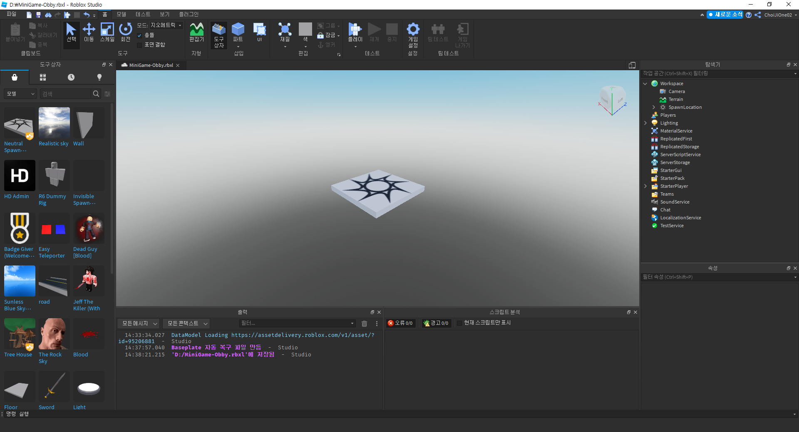  

다음으로, `SpawnLocation` 의 `Size`를 `10, 1, 10`, `Position`을 `0, 0, 0` 으로 변경합니다.  
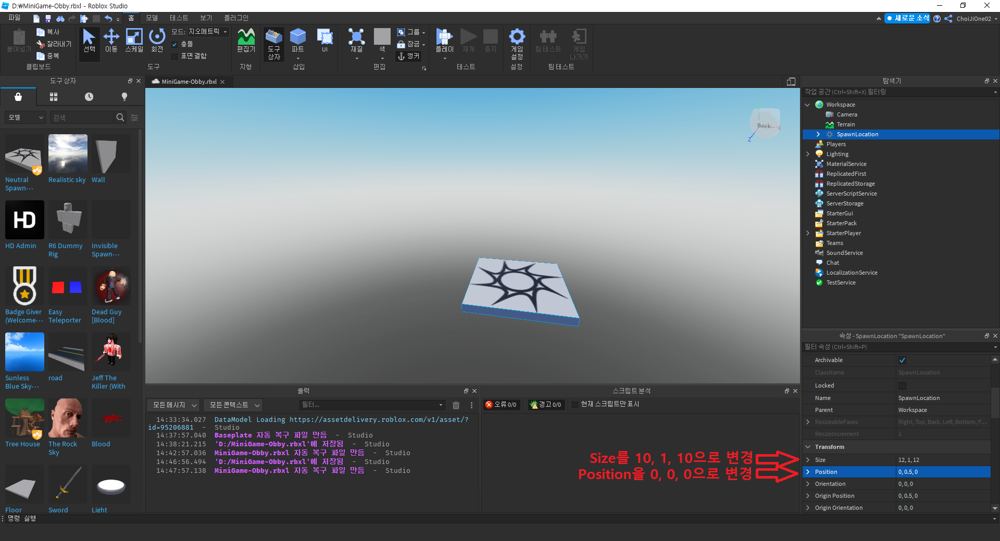  

속성창에서 변경된 `SpawnLocation`의 `Size`와 `Position`을 확인합니다.  
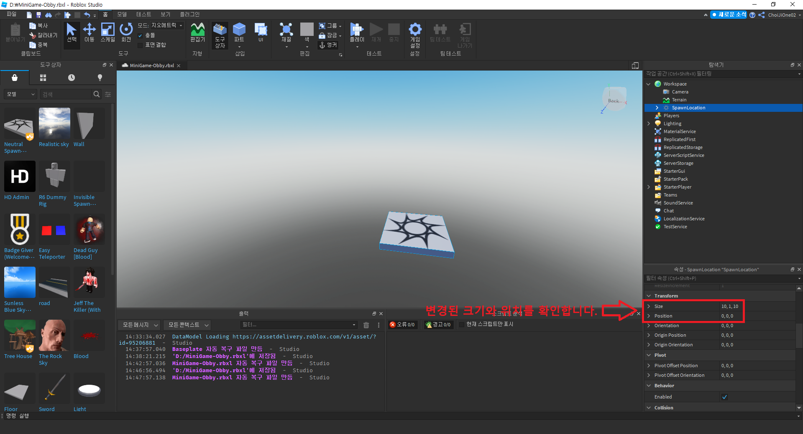  
<br><br>


## 2단계. Floor 구현

다음으로, 게임 진행 중 떨어질 경우 플레이어를 죽이기 위한 Floor를 구현하도록 하겠습니다.  
<br><br>

### 파트 생성

Floor 파트를 생성해보도록 하겠습니다.  
아래와 같이 파트를 생성합니다.  
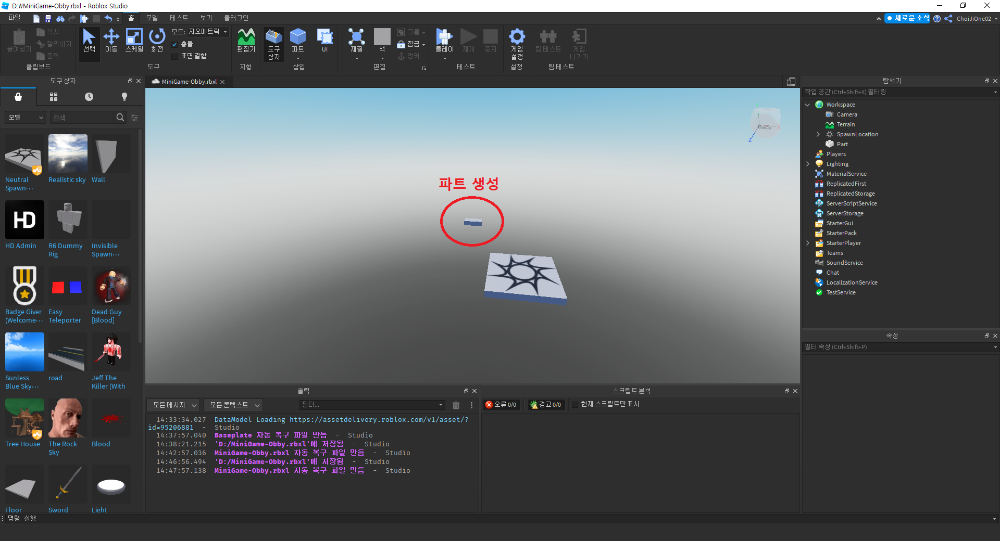  

파트를 생성했으면, 파트를 선택한 후 속성창에서 `Size`를 `2024, 1, 2024`, `Position`을 `0, -40, 0`를 입력합니다.  
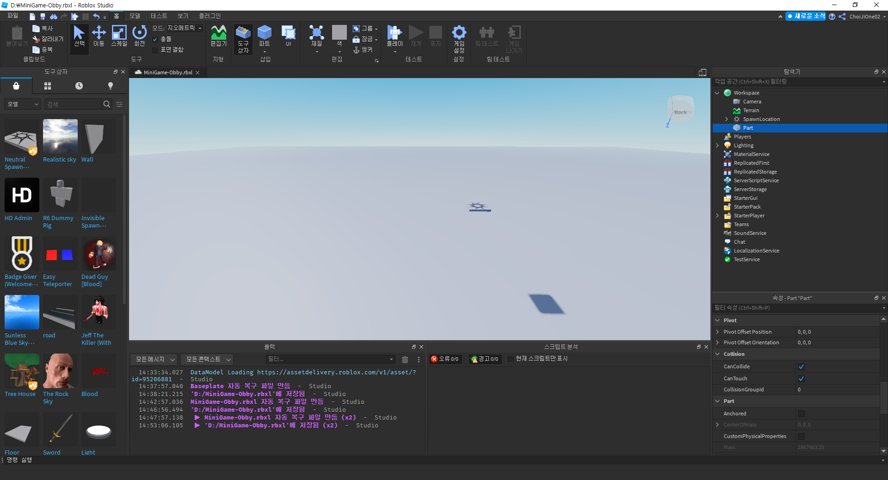  

다음으로 속성창에서 `Part`의 `Anchored` 에 체크해줍니다.  
> **경고 : 반드시 `Part`의 `Anchored` 에 체크해주어야 합니다. 아니면 게임 시작 시 아래로 떨어지게 됩니다.** 

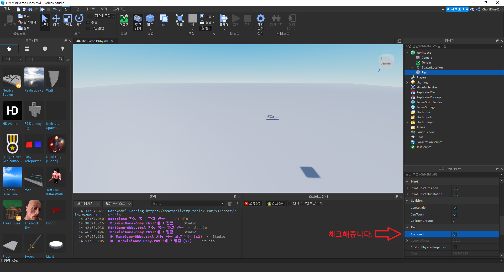  

다음으로 속성창에서 `Appearance`의 `BrickColor` 를 클릭합니다.  
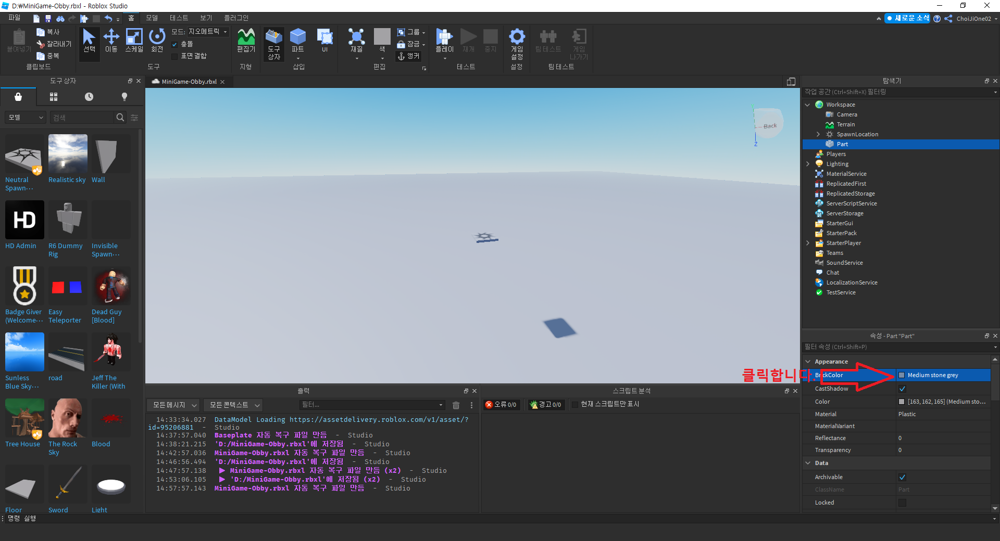  

클릭했으면 붉은색 계열의 색상을 클릭합니다.  
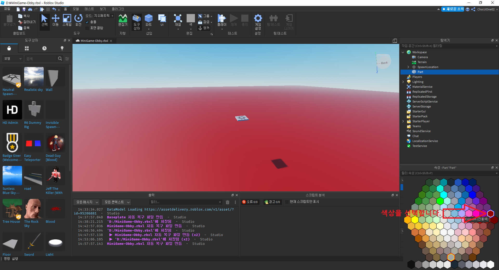  
<br><br>


### 스크립트 구현

이제, 플레이어가 Floor로 떨어졌을 때 죽이기 위한 스크립트를 구현하도록 하겠습니다.  
Floor파트 하위에 스크립트를 생성합니다.  
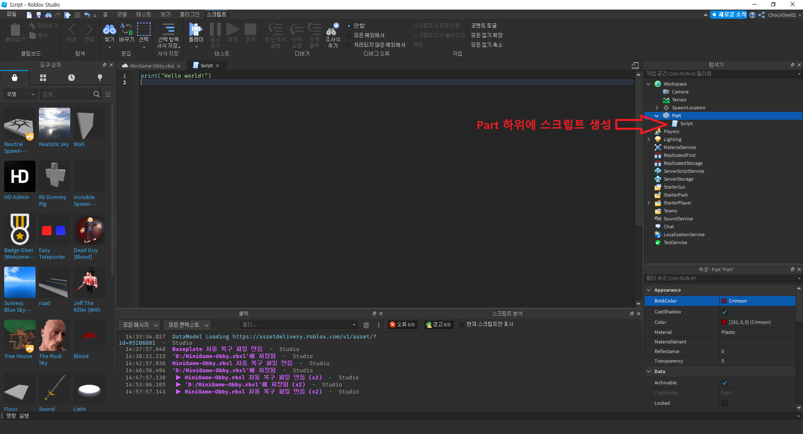  

생성된 스크립트에 다음 코드를 타핑합니다.  
```
local function OnTouched(part)
    local humanoid = part.Parent:FindFirstChild("Humanoid")

    if humanoid then
        humanoid.Health = 0
    end
end

script.Parent.Touched:Connect(OnTouched)
```

타이핑을 끝냈으면, 게임을 실행후 일부러 떨어져서 플레이어가 죽는지 확인합니다.  
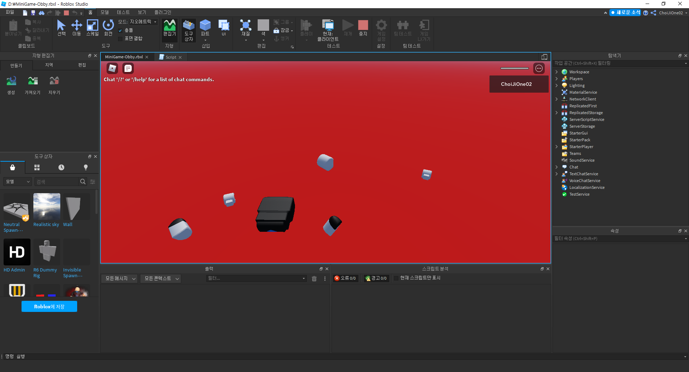  

마무리로 Part의 이름을 `Floor`으로 변경합니다.
  

변경된 이름을 확인합니다.  
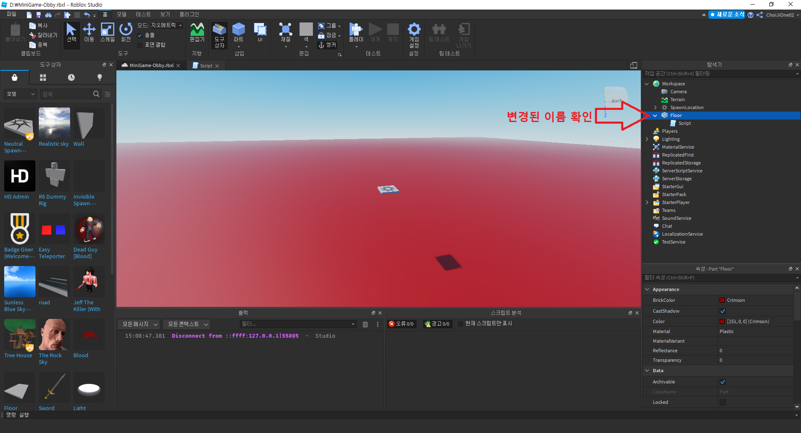  
<br><br>


## 3단계. 사라지는 함정 구현

다음으로, 게임 진행에 필요한 함정 중 사라지는 함정을 구현하도록 하겠습니다.  


### 파트 생성

사라지는 함정을 위한 파트를 생성해보도록 하겠습니다.  
아래와 같이 파트를 생성한 뒤 이름을 `DisappearTrap` 이라고 변경합니다.  
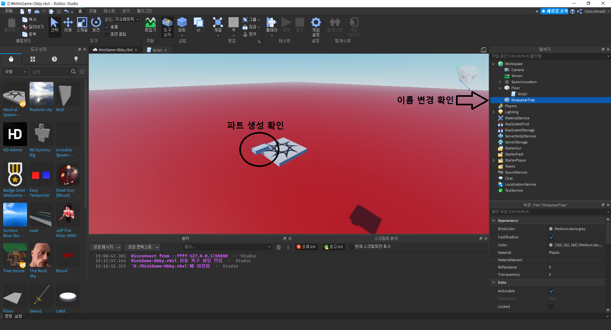  

다음으로 파트의 속성을 아래와 같이 변경합니다.  
`Size` : 10, 1, 10  
`Position` : 0, 0, -15  
`Anchored` : 체크  
  

속성을 변경했으면, 속성창 맨 아래의 속성 추가를 클릭합니다.  
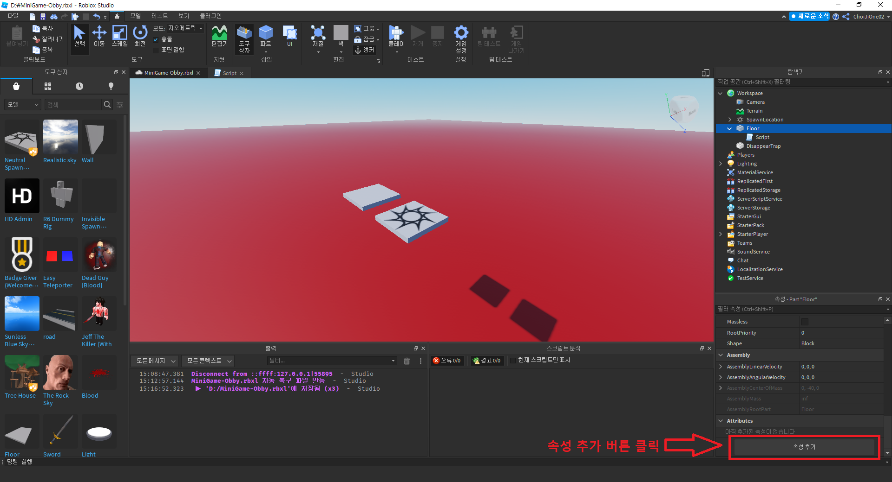  

속성 추가 버튼을 클릭했으면 `이름`에 `WaitTime`, 유형으로 `number`를 선택 후 저장 버튼을 클릭합니다.  
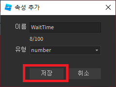  

생성했으면, `WaitTime`을 클릭한 뒤 3으로 설정합니다.  
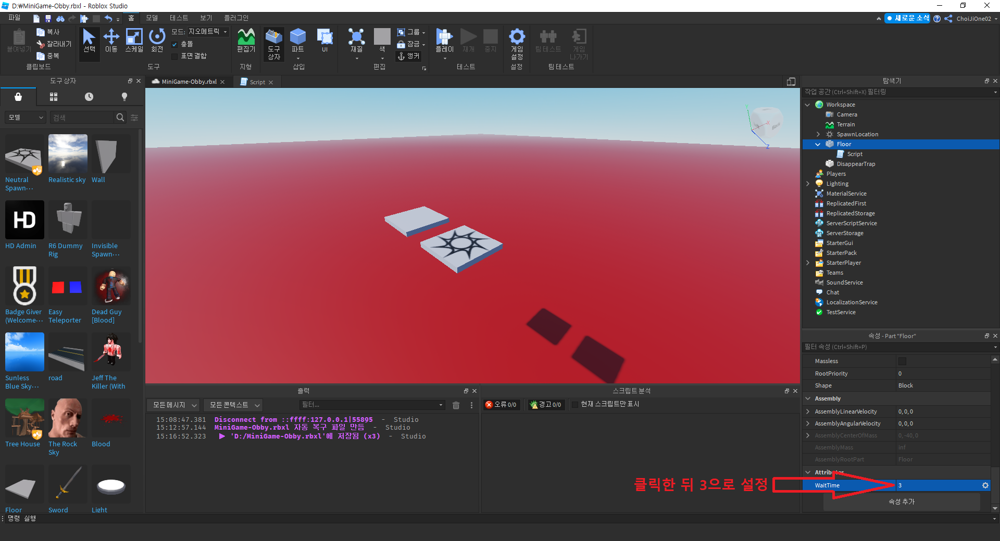  


### 스크립트 구현 

이제 특정 만큼 함정이 사라지는 스크립트를 구현하도록 하겠습니다.  
`DisappearTrap` 파트의 하위에 스크립트를 생성한 뒤 다음 코드를 타이핑합니다.  
```
local waitTime = script.Parent:GetAttribute("WaitTime")

while true do
	script.Parent.Transparency = 0
	script.Parent.CanCollide = true
	wait(waitTime)
	
	script.Parent.Transparency = 1
	script.Parent.CanCollide = false
	wait(waitTime)
end
```
타이핑을 끝냈으면, 게임을 실행한 후 파트가 사라지는 것을 확인합니다.  
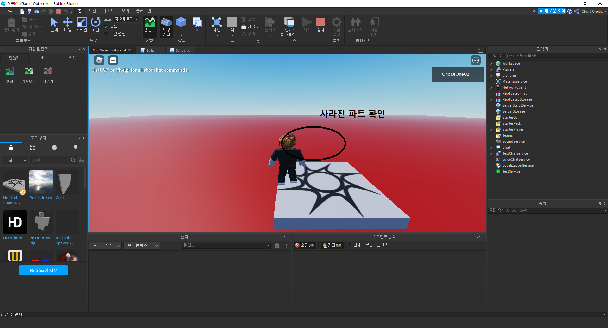  
<br><br>


## 4단계. 불타는 함정 구현

다음으로, 게임 진행에 필요한 함정 중 불타는 함정을 구현하도록 하겠습니다.  
<br><br>

### 파트 생성

불타는 함정을 위한 파트를 생성해보도록 하겠습니다.  
아래와 같이 파트를 생성한 뒤 이름을 `FireTrap`이라고 변경합니다.  
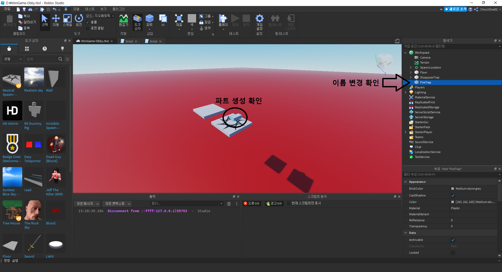  

다음으로 파트의 속성을 아래와 같이 변경합니다.  
`Size` : 10, 1, 10  
`Position` : 0, 0, -30  
`Anchored` : 체크  
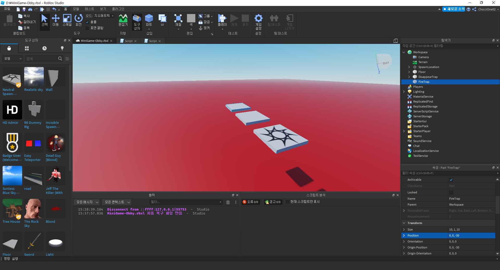  

3단계에서의 `WaitTime` 속성 추가와 같은 절차로 속성을 추가한 후 3으로 설정합니다.  
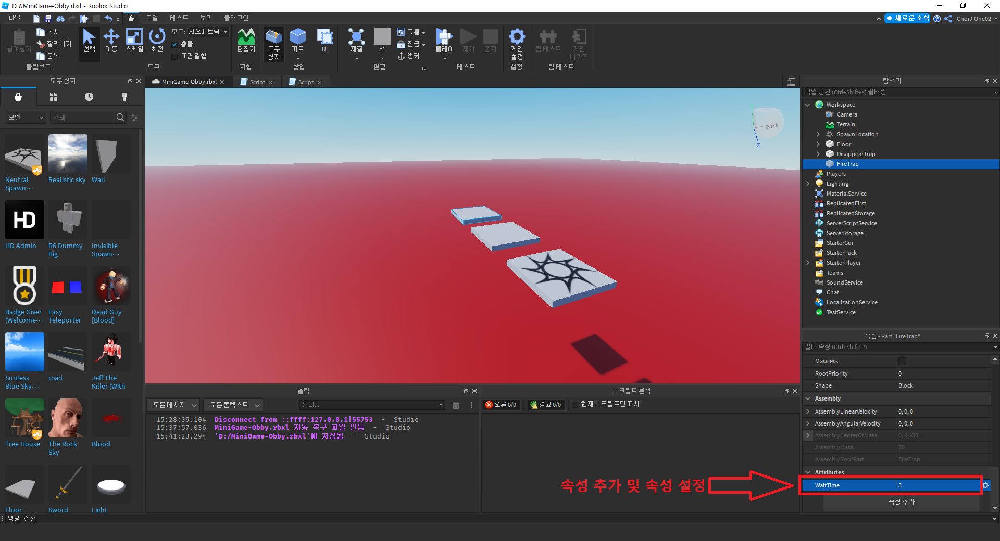  

다음으로 `FireTrap` 하위에 불 효과를 추가해줍니다.  
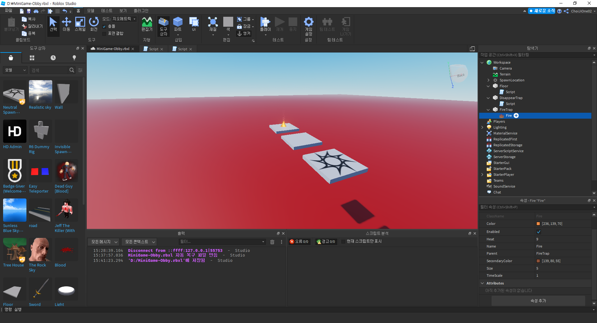  

불 효과를 추가했으면 불 효과 선택 후 속성 창의 `Enabled`의 체크를 해제합니다.
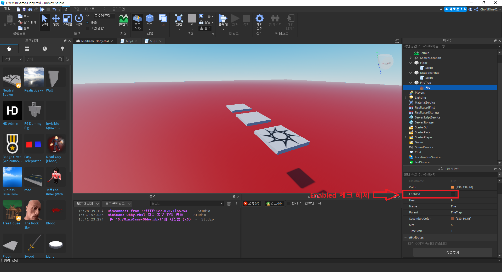  

계속해서 속성 창의 `Size` 를 30으로 설정합니다.  
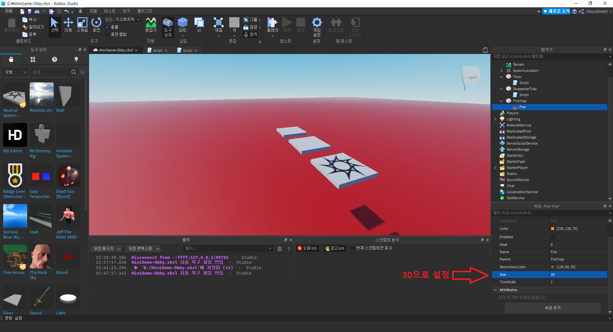  
<br><br>


### 스크립트 구현 

이제 불타는 함정을 위한 스크립트를 구현하도록 하겠습니다.  
`FireTrap` 파트의 하위에 스크립트를 생성한 뒤 다음 코드를 타이핑합니다.  
```
local waitTime = script.Parent:GetAttribute("WaitTime")
local bCanKillPlayer = false

local function OnTouched(part)
	if bCanKillPlayer then
		local humanoid = part.Parent:FindFirstChild("Humanoid")

		if humanoid then
			humanoid.Health = 0
		end
	end
end

script.Parent.Touched:Connect(OnTouched)

while true do
	script.Parent.Fire.Enabled = true
	bCanKillPlayer = true
	wait(waitTime)

	script.Parent.Fire.Enabled = false
	bCanKillPlayer = false
	wait(waitTime)
end
```
타이핑을 끝냈으면, 게임을 실행한 후 불타는 함정을 확인합니다.  
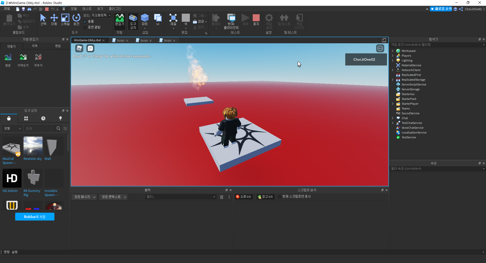  
<br><br>


## 5단계. 크기가 점점 작아지는 함정 구현

다음으로, 게임 진행에 필요한 함정 중 크기가 점점 작아지는 함정을 구현하도록 하겠습니다.  
<br><br>

### 파트 생성

크기가 점점 작아지는 함정을 위한 파트를 생성해보도록 하겠습니다.  
파트를 생성한 뒤 이름을 `DownSizeTrap`이라고 변경한 뒤 파트의 속성을 아래와 같이 변경합니다.  
`Size` : 10, 1, 10  
`Position` : 0, 0, -45  
`Anchored` : 체크  
  

3단계와 4단계에서의 `WaitTime` 속성 추가와 같은 절차로 속성을 추가한 후 3으로 설정합니다.  
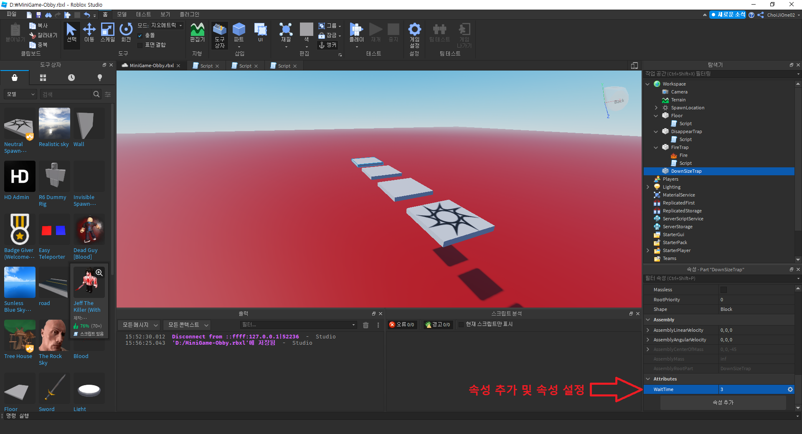  
<br><br>


### 스크립트 구현 

크기가 점점 작아지는 함정을 위한 스크립트를 구현하도록 하겠습니다.  
`DownSizeTrap` 파트의 하위에 스크립트를 생성한 뒤 다음 코드를 타이핑합니다.  
```
local waitTime = script.Parent:GetAttribute("WaitTime")

while true do
	for size = 10, 0, -2 do
        script.Parent.Size = Vector3.new(size, 1, size)
        wait(waitTime)
    end
end
```
타이핑을 끝냈으면, 게임을 실행한 후 크기가 점점 작아지는 함정을 확인합니다.  
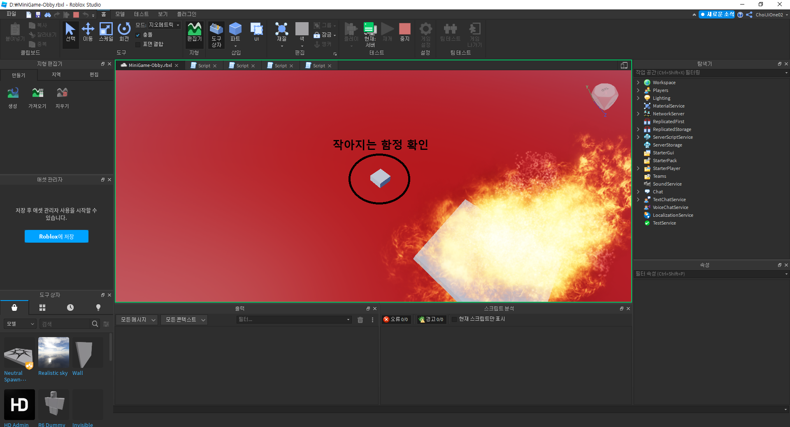  
<br><br>


## 6단계. 강제로 플레이어를 죽이는 함정 구현

다음으로, 게임 진행에 필요한 함정 중 플레이어를 강제로 죽이는 함정을 구현하도록 하겠습니다.  
<br><br>


### 파트 생성

플레이어를 강제로 죽이는 함정을 위한 파트를 생성해보도록 하겠습니다.  
파트를 생성한 뒤 이름을 `KillTrap`이라고 변경한 뒤 파트의 속성을 아래와 같이 변경합니다.  
`Size` : 10, 1, 10  
`Position` : 0, 0, -60  
`Anchored` : 체크  
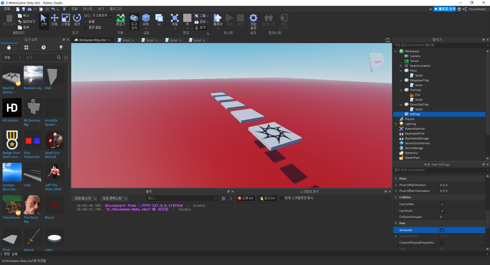  

3, 4, 5단계에서의 `WaitTime` 속성 추가와 같은 절차로 속성을 추가한 후 3으로 설정합니다.  
  
<br><br>


### 스크립트 구현 

플레이어를 강제로 죽이는 함정을 위한 스크립트를 구현하도록 하겠습니다.  
`KillTrap` 파트의 하위에 스크립트를 생성한 뒤 다음 코드를 타이핑합니다.  
```
local waitTime = script.Parent:GetAttribute("WaitTime")
local bCanKillPlayer = false

local function OnTouched(part)
	if bCanKillPlayer then
		local humanoid = part.Parent:FindFirstChild("Humanoid")

		if humanoid then
			humanoid.Health = 0
		end
	end
end

script.Parent.Touched:Connect(OnTouched)

while true do
	script.Parent.Color = Color3.fromRGB(255, 0, 0)
	bCanKillPlayer = true
	wait(waitTime)
	
	script.Parent.Color = Color3.fromRGB(0, 0, 255)
	bCanKillPlayer = false
	wait(waitTime)
end
```
타이핑을 끝냈으면, 게임을 실행한 후 플레이어를 강제로 죽이는 함정을 확인합니다.  
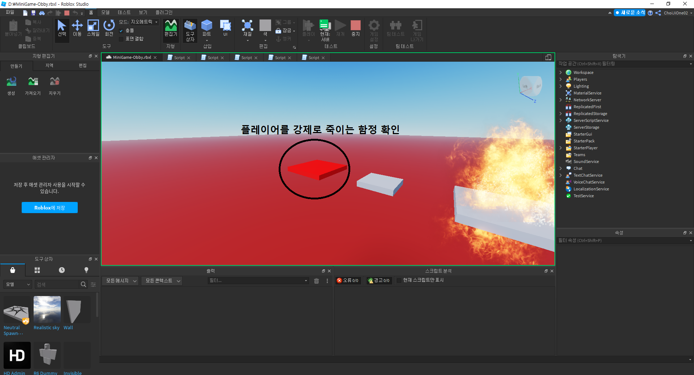  
<br><br>


## 7단계. 처음 위치로 이동시키는 함정 구현

다음으로, 게임 진행에 필요한 함정 중 플레이어를 처음 위치로 이동시키는 함정을 구현하도록 하겠습니다.  
<br><br>


### 파트 생성

플레이어를 처음 위치로 이동시키는 함정을 위한 파트를 생성해보도록 하겠습니다.  
파트를 생성한 뒤 이름을 `TeleportTrap`이라고 변경한 뒤 파트의 속성을 아래와 같이 변경합니다.  
`Size` : 10, 1, 10  
`Position` : 0, 0, -75  
`Anchored` : 체크  
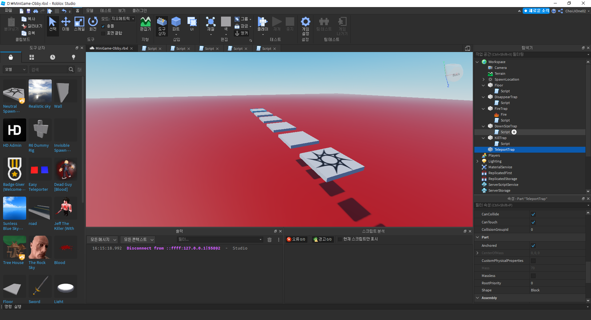  

3, 4, 5, 6단계에서의 `WaitTime` 속성 추가와 같은 절차로 속성을 추가한 후 3으로 설정합니다.  
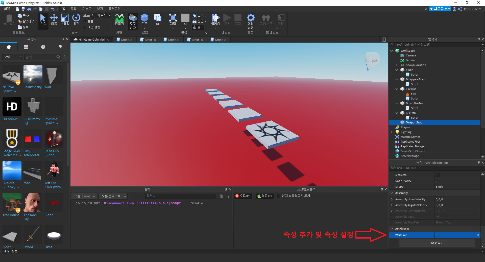  
<br><br>


### 스크립트 구현 

플레이어를 처음 위치로 이동시키는 함정을 위한 스크립트를 구현하도록 하겠습니다.  
`TeleportTrap` 파트의 하위에 스크립트를 생성한 뒤 다음 코드를 타이핑합니다.  
```
local waitTime = script.Parent:GetAttribute("WaitTime")
local bCanTeleportPlayer = false

local function OnTouched(part)
	if bCanTeleportPlayer then
		local humanoid = part.Parent:FindFirstChild("Humanoid")
		local spawnLocation = script.Parent.Parent:FindFirstChild("SpawnLocation")
		part.Parent:moveTo(spawnLocation.Position)
	end
end

script.Parent.Touched:Connect(OnTouched)

while true do
	script.Parent.Color = Color3.fromRGB(0, 255, 0)
	bCanTeleportPlayer = true
	wait(waitTime)

	script.Parent.Color = Color3.fromRGB(0, 0, 255)
	bCanTeleportPlayer = false
	wait(waitTime)
end
```
타이핑을 끝냈으면, 게임을 실행한 후 플레이어를 처음 위치로 이동시키는 함정을 확인합니다.  
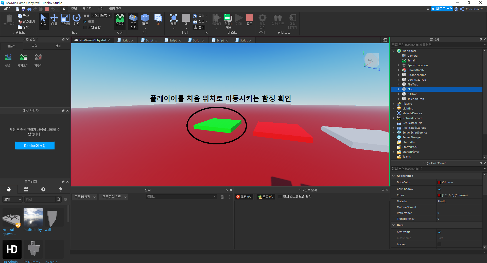  
<br><br>


## 8단계. 게임 디자인
<br><br>


## 9단계. 게임 업로드

<br><br>